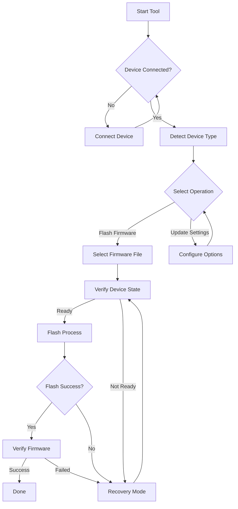

# VSD-WCH-Utility 🔧

[](https://www.python.org/downloads/)
[](LICENSE)
[](https://www.linux.org/)

A modern, user-friendly command-line tool for updating firmware on WCH-Link devices, with special support for VSD Squadran Mini. The tool automatically detects your operating system and installs all necessary dependencies.

## 🔄 Workflow



### 📋 Step-by-Step Process

1. **Initial Setup** 🚀
   - Tool automatically detects OS
   - Installs required dependencies
   - Sets up system permissions

2. **Device Detection** 🔍
   - Automatically scans for WCH-Link devices
   - Identifies device type and current firmware
   - Verifies USB connection status

3. **Firmware Selection** 💾
   - Choose from available firmware options
   - Automatic firmware validation
   - Version compatibility check

4. **Flashing Process** ⚡
   - Automatic backup of current firmware
   - Progressive flashing with status updates
   - Real-time error checking and recovery

5. **Verification** ✅
   - Post-flash integrity check
   - Device functionality verification
   - Automatic recovery if needed

## ✨ Features

- 🚀 Easy-to-use interactive interface
- 🔄 Support for multiple device types
- 🛡️ Built-in error handling and recovery
- 📊 Real-time progress tracking
- 🔌 Automatic device detection
- 💾 Settings persistence
- 🎯 Specialized support for VSD Squadran Mini
- 🖥️ Linux support
- 🔧 Automatic dependency installation

## 🚀 Quick Start

### Prerequisites

Just Python 3.6 or higher! The tool will automatically install all other dependencies:

- ✅ Git (auto-installed if missing)
- ✅ Rust toolchain (auto-installed if missing)
- ✅ Linux requirements:
  - libusb
  - pkg-config

### Installation

```bash
# Clone the repository
git clone https://github.com/Sikandar-irfan/VSD-WCH-Utility.git
cd VSD-WCH-Utility

# Run the automatic setup
python flash_tool.py --setup
```

### Usage

```bash
python flash_tool.py
```

## 🔧 Supported Devices

### VSD Squadran Mini (CH32V30X)
- Specialized flashing sequence
- Automatic chip detection
- Optimized update process

### Other WCH-Link Devices
- Configurable speed options
- Multiple erase methods
- Automatic chip detection

## ⚡ Performance Tips

- Keep USB connection stable during flashing
- Use high-quality USB cables
- Close other programs accessing the device
- Ensure proper permissions are set

## 🛠️ Troubleshooting

### Common Issues

1. **USB Connection Issues**
   - Check USB cable connection
   - Verify device permissions
   - Try different USB ports

2. **Installation Problems**
   - Run setup with sudo if needed
   - Check system package manager
   - Verify internet connection

3. **Flashing Errors**
   - Ensure correct firmware file
   - Check device connection
   - Verify device permissions

## 📄 License

This project is licensed under the MIT License - see the [LICENSE](LICENSE) file for details.

---

<p align="center">
Made with ❤️ by Sikandar Irfan
</p> 
